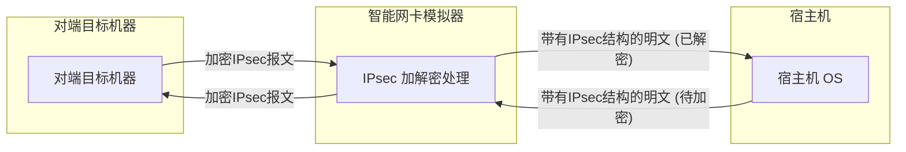

# 智能网卡（SmartNIC）IPsec半卸载模拟器设计文档

## 1. 项目概述

本项目是一个软件的智能网卡（SmartNIC）模拟器，专注于IPsec（Internet Protocol Security）的半卸载（Partial Offload）功能。在半卸载模型中，主机操作系统负责构建IPsec报文的头部结构（如ESP头），而网卡则承担计算密集型的加密、解密以及完整性校验（HMAC）等工作。**该项目可作为芯片或FPGA实现的基础验证模型。**

本模拟器旨在精确模拟这一过程：它通过裸套接字（Raw Socket）接收来自主机或外部网络的IPsec报文，利用独立的密码学模块进行加解密和HMAC重新计算，最后将处理完成的报文转发出去。

## 2. 设计目标

*   **功能模拟**：准确模拟IPsec ESP（Encapsulating Security Payload）协议在半卸载模式下的出向（加密）和入向（解密）处理流程。
*   **高性能**：最大化保证性能优势和安全特性，结合裸套接字进行高效的网络包处理，最小化处理延迟。
*   **模块化**：代码结构清晰，将网络I/O、报文解析和密码学操作分离到不同模块，便于维护和扩展。
*   **可扩展性**：设计应支持未来扩展更多种类的加密算法或完整性校验算法。

## 3. 整体架构

### 3.1. 架构图

### 3.2. 模块职责

根据项目源码结构，各模块的核心职责如下：

*   **`src/main`**:
    *   **程序入口**：初始化日志、配置，创建并启动核心处理线程。
    *   **总协调**：管理`raw_socket`、`esp_inspector`和`crypto`等模块的生命周期和交互。
    *   **配置管理**：加载安全关联（Security Association, SA）等配置信息，构建SADB。

*   **`src/raw_socket`**:
    *   **网络接口层**：负责创建和管理裸套接字，实现底层网络数据包的收发。
    *   **报文捕获**：监听指定的网络接口，捕获所有传入的IP报文。
    *   **报文发送**：将经过处理的报文通过裸套接字发送到目标地址。

*   **`src/esp_inspector`**:
    *   **报文解析与识别**：检查传入的IP报文，判断其是否为ESP报文。
    *   **头部解析**：从ESP报文中提取关键信息，主要是**SPI（Security Parameters Index）**。
    *   **数据提取**：分离出需要加密或解密的载荷（Payload）以及原始的完整性校验值（ICV/HMAC）。
    *   **报文重组**：将加密/解密后的数据与新的ICV重新组装成一个完整的ESP报文，供`raw_socket`模块发送。

*   **`src/crypto`**:
    *   **密码学核心**：封装所有加密、解密和哈希计算的逻辑。
    *   **算法实现**：根据SADB提供的算法类型（如AES-GCM, SHA256-HMAC），执行具体操作。
    *   **加解密**：对`esp_inspector`传入的载荷进行加密或解密。
    *   **完整性校验**：
        *   **出向**：为加密后的报文计算新的HMAC值。
        *   **入向**：校验接收到的报文的HMAC值是否正确，以确保数据未被篡改。

## 4. 核心流程

### 4.1. 出向 (加密与转发) 流程

此流程模拟数据从主机发送到外部网络的过程。

1.  **接收报文**：`raw_socket`模块从主机接收到一个构造好的IPsec报文。此时，报文的载荷是明文，HMAC字段为空或占位。
2.  **解析报文**：`esp_inspector`模块解析报文，识别出ESP协议，并提取出SPI和明文载荷。
3.  **查询SA**：使用SPI在SADB（一个通常由`main.rs`初始化并维护的`HashMap`）中查询对应的安全关联，获取加密密钥、加密算法、完整性密钥和完整性算法。
4.  **加密载荷**：`crypto`模块使用获取到的加密密钥和算法，对明文载荷进行加密。
5.  **计算HMAC**：`crypto`模块使用获取到的完整性密钥和算法，对ESP头和加密后的载荷计算新的HMAC值（ICV）。
6.  **重组报文**：`esp_inspector`模块将加密后的载荷和新计算出的HMAC值填充回报文的相应位置。
7.  **发送报文**：`raw_socket`模块将处理完成的加密报文发送到外部网络。

### 4.2. 入向 (解密与转发) 流程

此流程模拟从外部网络接收数据并转发给主机的过程。

1.  **接收报文**：`raw_socket`模块从外部网络接收到一个加密的ESP报文。
2.  **解析报文**：`esp_inspector`模块解析报文，提取SPI、加密载荷和报文中包含的HMAC值。
3.  **查询SA**：同出向流程，使用SPI查询SADB，获取解密密钥和完整性校验相关信息。
4.  **校验HMAC**：`crypto`模块使用完整性密钥和算法，对接收到的ESP头和加密载荷计算一个HMAC值，并与报文中自带的HMAC值进行比对。
    *   如果**不匹配**，说明报文可能被篡改或已损坏，模拟器将**丢弃该报文**。
    *   如果**匹配**，则进入下一步。
5.  **解密载荷**：`crypto`模块使用获取到的解密密钥和算法，对加密载荷进行解密，还原出明文数据。
6.  **重组报文**：`esp_inspector`模块移除ESP头部和尾部，将IP头和解密后的明文载荷重组成一个标准的IP报文。
7.  **发送报文**：`raw_socket`模块将解密后的明文报文发送给主机。

## 5. 潜在挑战与未来展望

*   **性能优化**：在多核环境下，可以考虑使用多线程模型，为不同的CPU核心分配独立的收发队列和处理逻辑，以提升吞吐量。
*   **SA管理**：目前SA可能是静态配置。未来可以模拟IKEv2协议，实现动态的SA协商和密钥交换。
*   **算法支持**：当前`crypto`模块可以进一步抽象，通过插件化的方式支持更多的加解密算法和哈希算法。
*   **IPv6支持**：扩展`esp_inspector`模块，使其能够正确解析和处理IPv6报文中的ESP。
